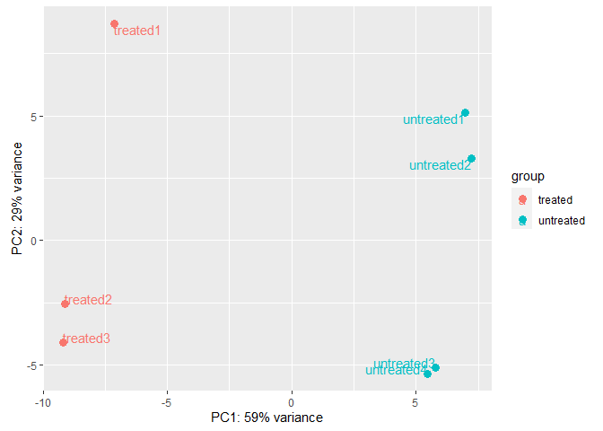
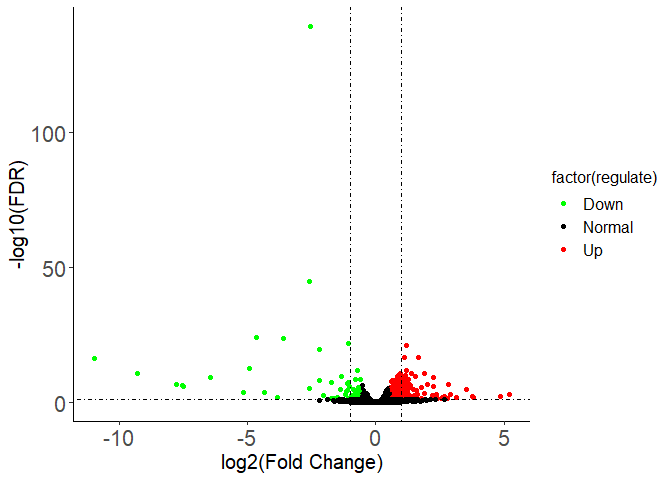
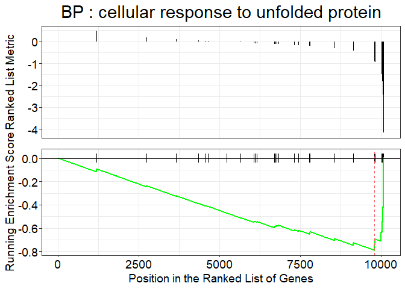
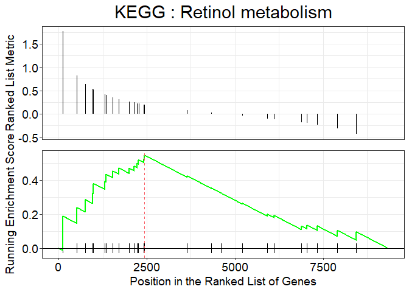

RNAseq 工作流程
---------------

    library(RNAseqFlow)
    input = createCountPhe()

    dds = DEseqObj(count_data=input[[1]],col_data=input[[2]],design_names = "condition+type",group_name ="condition",ref_level = "untreated")
    #> [1] "The id order between gene count file and phenotype file is identical without modification!"
    res = DESeqRes(dds,foldChange=0.58,adjPvalue=0.05)
    DESeqObjPCA(dds) # plot PCA

    DESeqResVolcano(res) # plot volcano

    DEsig = row.names(res)[res$regulate!="Normal"]

富集分析
--------

加载一些程序包：

    library(org.Dm.eg.db)
    library(clusterProfiler)

### GO 过度代表检验 (over-representation test)

    goRes = GO(DEsig,type="ENSEMBL",db=org.Dm.eg.db)

为了方便查看，需要把GO和KEGG的结果保存为文件时，base\_name参数可以实现这个功能。

### KEGG 过度代表检验 (over-representation test)

    keggRes = KEGG(DEsig,type="ENSEMBL",organism="dme",db=org.Dm.eg.db);
    head(keggRes)
    #>                ID                                 Description GeneRatio  BgRatio       pvalue   p.adjust
    #> dme04141 dme04141 Protein processing in endoplasmic reticulum     11/77 135/3263 0.0002598714 0.01481267
    #>              qvalue                                                               geneID Count
    #> dme04141 0.01449809 318098/36310/39474/35480/3355079/43785/34433/32180/44921/48582/48583    11

值得注意的是，当进行KEGG或gseKEGG时，如果物种是人类，那么基因名为ENTREZID时，对应的keyType是“kegg”或“ncbi-geneid”。当对其它物种进行分析时，ENTREZID对应的是ncbi-geneid。

### GO的GSEA分析

    geneList = res$log2FoldChange
    names(geneList)=row.names(res)
    gseagoRes = GSEAgo(geneList,type="ENSEMBL",db=org.Dm.eg.db)
    head(gseagoRes)
    #>                    ID                                          Description setSize enrichmentScore
    #> GO:0034620 GO:0034620                cellular response to unfolded protein      31      -0.7915683
    #> GO:0006986 GO:0006986                         response to unfolded protein      33      -0.7833215
    #> GO:0035967 GO:0035967 cellular response to topologically incorrect protein      45      -0.7009554
    #> GO:0042026 GO:0042026                                    protein refolding      16      -0.8571092
    #> GO:0035966 GO:0035966          response to topologically incorrect protein      47      -0.6964722
    #>                  NES       pvalue   p.adjust    qvalues rank                  leading_edge
    #> GO:0034620 -2.251655 6.911188e-06 0.01024721 0.01024721  297 tags=23%, list=3%, signal=22%
    #> GO:0006986 -2.266891 7.655743e-06 0.01024721 0.01024721  297 tags=21%, list=3%, signal=21%
    #> GO:0035967 -2.154785 1.585020e-05 0.01414366 0.01414366  451 tags=22%, list=4%, signal=21%
    #> GO:0042026 -2.149696 4.627369e-05 0.03096867 0.03096867  104 tags=44%, list=1%, signal=43%
    #> GO:0035966 -2.166721 7.912020e-05 0.04236095 0.04236095  451 tags=21%, list=4%, signal=20%
    #>                                                                          core_enrichment
    #> GO:0034620                         Gba1b/CG1924/Hsc70-2/Hsp70Ba/Hsp70Bbb/Hsp70Ba/Hsp70Ba
    #> GO:0006986                         Gba1b/CG1924/Hsc70-2/Hsp70Ba/Hsp70Bbb/Hsp70Ba/Hsp70Ba
    #> GO:0035967 CG32640/Gba1b/CG1924/CG32640/Hsc70-2/Hsp70Ba/Hsp70Bbb/Hsp70Ba/Hsp70Ba/CG32581
    #> GO:0042026                         Hsp27/Hsp60A/Hsc70-2/Hsp70Ba/Hsp70Bbb/Hsp70Ba/Hsp70Ba
    #> GO:0035966 CG32640/Gba1b/CG1924/CG32640/Hsc70-2/Hsp70Ba/Hsp70Bbb/Hsp70Ba/Hsp70Ba/CG32581
    if(nrow(gseagoRes)>=1){
      print(gseaplot(gseagoRes,geneSetID=gseagoRes$ID[1],title=paste("BP : ",gseagoRes$Description[1],sep="")))
    }

### KEGG的GSEA分析

    gseakeggRes = GSEAkegg(geneList,type="ENSEMBL",organism = "dme",db=org.Dm.eg.db,pvalueCutoff=1)

    if(nrow(gseakeggRes)>1){
      print(gseaplot(gseakeggRes,geneSetID=gseakeggRes$ID[1],title=paste("KEGG : ",gseakeggRes$Description[1],sep="")))
    }

