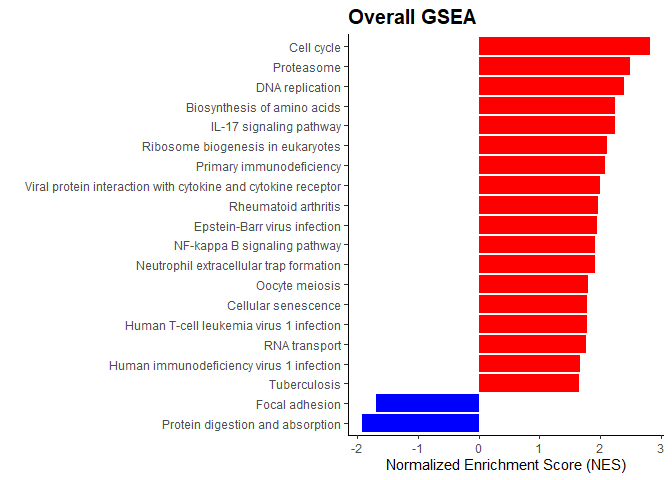

## RNAseq 工作流程

    library(RNAseqFlow)
    input = createCountPhe()

    dds = DEseqObj(count_data=input[[1]],col_data=input[[2]],design_names = "condition+type",group_name ="condition",ref_level = "untreated")
    #> [1] "The id order between gene count file and phenotype file is identical without modification!"
    res = DESeqRes(dds,foldChange=0.58,adjPvalue=0.05)
    DESeqObjPCA(dds) # plot PCA

    DESeqResVolcano(res) # plot volcano

    DEsig = row.names(res)[res$regulate!="Normal"]

## 富集分析

加载一些程序包：

    library(org.Dm.eg.db)
    library(clusterProfiler)

### GO 过度代表检验 (over-representation test)

    goRes = GO(DEsig,type="ENSEMBL",db=org.Dm.eg.db)
    head(goRes)
    #>                    ID                              Description GeneRatio   BgRatio       pvalue
    #> GO:0006352 GO:0006352  DNA-templated transcription, initiation    26/259 110/12234 2.058210e-20
    #> GO:0006334 GO:0006334                      nucleosome assembly    23/259  97/12234 3.258471e-18
    #> GO:0034728 GO:0034728                  nucleosome organization    26/259 138/12234 8.927875e-18
    #> GO:0031497 GO:0031497                       chromatin assembly    24/259 127/12234 1.599977e-16
    #> GO:0006333 GO:0006333        chromatin assembly or disassembly    24/259 156/12234 2.039940e-14
    #> GO:0071824 GO:0071824 protein-DNA complex subunit organization    26/259 198/12234 7.710321e-14
    #>                p.adjust       qvalue
    #> GO:0006352 3.112014e-17 3.048317e-17
    #> GO:0006334 2.463404e-15 2.412983e-15
    #> GO:0034728 4.499649e-15 4.407551e-15
    #> GO:0031497 6.047913e-14 5.924125e-14
    #> GO:0006333 6.168779e-12 6.042518e-12
    #> GO:0071824 1.943001e-11 1.903232e-11
    #>                                                                                                                                                                                                                                                                                                                              geneID
    #> GO:0006352 His4r/His4:CG31611/His4:CG33869/His4:CG33909/His4:CG33905/His4:CG33901/His4:CG33899/His4:CG33875/His4:CG33883/His4:CG33897/His4:CG33873/His4:CG33881/His4:CG33885/His4:CG33877/His4:CG33903/His4:CG33893/His4:CG33889/His4:CG33879/His4:CG33895/His4:CG33887/His4:CG33891/His4:CG33907/His4:CG33871/Tif-IA/Taf10/CG32856
    #> GO:0006334                      His4r/His4:CG31611/His4:CG33869/His4:CG33909/His4:CG33905/His4:CG33901/His4:CG33899/His4:CG33875/His4:CG33883/His4:CG33897/His4:CG33873/His4:CG33881/His4:CG33885/His4:CG33877/His4:CG33903/His4:CG33893/His4:CG33889/His4:CG33879/His4:CG33895/His4:CG33887/His4:CG33891/His4:CG33907/His4:CG33871
    #> GO:0034728    His4r/His4:CG31611/His4:CG33869/His4:CG33909/His4:CG33905/His4:CG33901/His4:CG33899/His4:CG33875/His4:CG33883/His4:CG33897/His4:CG33873/His4:CG33881/His4:CG33885/His4:CG33877/His4:CG33903/His4:CG33893/His4:CG33889/His4:CG33879/His4:CG33895/His4:CG33887/His4:CG33891/His4:CG33907/His4:CG33871/Trl/Nipped-A/Ing3
    #> GO:0031497                  His4r/His4:CG31611/His4:CG33869/His4:CG33909/His4:CG33905/His4:CG33901/His4:CG33899/His4:CG33875/His4:CG33883/His4:CG33897/His4:CG33873/His4:CG33881/His4:CG33885/His4:CG33877/His4:CG33903/His4:CG33893/His4:CG33889/His4:CG33879/His4:CG33895/His4:CG33887/His4:CG33891/His4:CG33907/His4:CG33871/Trl
    #> GO:0006333                  His4r/His4:CG31611/His4:CG33869/His4:CG33909/His4:CG33905/His4:CG33901/His4:CG33899/His4:CG33875/His4:CG33883/His4:CG33897/His4:CG33873/His4:CG33881/His4:CG33885/His4:CG33877/His4:CG33903/His4:CG33893/His4:CG33889/His4:CG33879/His4:CG33895/His4:CG33887/His4:CG33891/His4:CG33907/His4:CG33871/Trl
    #> GO:0071824    His4r/His4:CG31611/His4:CG33869/His4:CG33909/His4:CG33905/His4:CG33901/His4:CG33899/His4:CG33875/His4:CG33883/His4:CG33897/His4:CG33873/His4:CG33881/His4:CG33885/His4:CG33877/His4:CG33903/His4:CG33893/His4:CG33889/His4:CG33879/His4:CG33895/His4:CG33887/His4:CG33891/His4:CG33907/His4:CG33871/Trl/Nipped-A/Ing3
    #>            Count
    #> GO:0006352    26
    #> GO:0006334    23
    #> GO:0034728    26
    #> GO:0031497    24
    #> GO:0006333    24
    #> GO:0071824    26

为了方便查看，需要把GO和KEGG的结果保存为文件时，base\_name参数可以实现这个功能。

### KEGG 过度代表检验 (over-representation test)

    keggRes = KEGG(DEsig,type="ENSEMBL",organism="dme",db=org.Dm.eg.db);
    head(keggRes)
    #>                ID                                 Description GeneRatio  BgRatio       pvalue
    #> dme04141 dme04141 Protein processing in endoplasmic reticulum     11/80 135/3263 0.0003663251
    #>            p.adjust     qvalue                                                               geneID
    #> dme04141 0.02088053 0.02043708 318098/36310/39474/35480/3355079/43785/34433/32180/44921/48582/48583
    #>          Count
    #> dme04141    11

值得注意的是，当进行KEGG或gseKEGG时，如果物种是人类，那么基因名为ENTREZID时，对应的keyType是“kegg”或“ncbi-geneid”。当对其它物种进行分析时，ENTREZID对应的是ncbi-geneid。

### GO的GSEA分析

    geneList = res$log2FoldChange
    names(geneList)=row.names(res)
    gseagoRes = GSEAgo(geneList,type="ENSEMBL",db=org.Dm.eg.db,setReadable=TRUE)
    head(gseagoRes)
    #> [1] ID              Description     setSize         enrichmentScore NES             pvalue         
    #> [7] p.adjust        qvalues        
    #> <0 行> (或0-长度的row.names)
    if(nrow(gseagoRes)>=1){
      print(gseaplot(gseagoRes,geneSetID=gseagoRes$ID[1],title=paste("BP : ",gseagoRes$Description[1],sep="")))
    }

### KEGG的GSEA分析

    gseakeggRes = GSEAkegg(geneList,type="ENSEMBL",organism = "dme",db=org.Dm.eg.db,pvalueCutoff=1)
    if(nrow(gseakeggRes)>1){
      print(gseaplot(gseakeggRes,geneSetID=gseakeggRes$ID[1],title=paste("KEGG : ",gseakeggRes$Description[1],sep="")))
    }

### GSEA using human databale

    data(geneList,package = "DOSE")
    gseagoRes = GSEAgo(geneList,OrgDb = org.Hs.eg.db,setReadable=TRUE)
    print(overallGSEA(head(gseagoRes,20),Description,NES))

    gseakeggRes = GSEAkegg(geneList,organism = "hsa",type = "ENTREZID")
    print(overallGSEA(head(gseakeggRes,20),Description,NES))

## Todo

添加batch相关信息，将RNAseqWorkflowDEseq2的内容合并进来。
